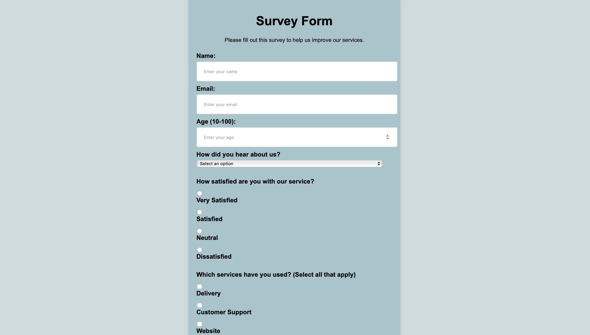

# SurveryForm
 Survey form for certification project

# 📋 Survey Form

> A responsive user feedback survey form built as part of the freeCodeCamp certification curriculum, designed to collect user input with accessible, semantic form elements.

---

## 🌐 Live Site  
[View the Survey Form](https://cfree87.github.io/survey/)

---

## 🛠️ Built With  
- HTML5  
- CSS3  
- Git & GitHub  
- Responsive Web Design Principles  

---

## 📸 Screenshots  


---

## 📄 Features  
- ✅ Responsive layout for mobile, tablet, and desktop  
- ✅ Clean and intuitive user experience  
- ✅ Form validation with required fields  
- ✅ Dropdowns, radio buttons, checkboxes, and text areas  
- ✅ Semantic HTML for accessibility  

---

## 💡 Inspiration  
This project was created as part of the Responsive Web Design Certification on [freeCodeCamp](https://www.freecodecamp.org). The goal was to demonstrate an understanding of accessible form design and proper use of HTML form elements.

---

## 🚀 How to Use  
1. Clone this repository:
   ```bash
   git clone https://github.com/cfree87/survey.git
   ```

2. Open `index.html` in your browser  
   _or_  
   Use a local development server (like Live Server in VS Code)  

---

## ✍️ Author  
**Christopher Freeman**  
📧 [FWDbyChristopher@gmail.com](mailto:FWDbyChristopher@gmail.com)  
🔗 [LinkedIn Profile](https://www.linkedin.com/in/christopher-freeman-05497322a/)

---

## 📘 License  
This project is licensed under the MIT License - see the [LICENSE](LICENSE) file for details.